# Cinema Reservation Project

* [1 - Model de Date](#1---model-de-date)
* [2 - Operatii CRUD](#2---operatii-crud)
* [3 - Configurare Multi-Environment](#3---configurare-multi-environment)
* [4 - Testing](#4---testing)
  * [4.1 - Teste unitare](#4.1---teste-unitare)
  * [4.2 - Teste de integrare](#4.2---teste-de-integrare)
* [5 - Views si Validare](#5---views-si-validare)
  * [5.1 - Use View](#5.1---user-view)
  * [5.2 - Admin View](#5.2--admin-view)
* [6 - Logging](#6---logging)
* [7 - Paginare si Sortare](#7---paginare-si-sortare)
* [8 - Spring Security](#8---spring-security)

## 1 - Model de Date

Proiectul **Cinema Reservation** este o aplicatie web de tip *monolit* care are ca scop gestionarea activitatii unui cinematograf. 
Accesul in platforma se realizeaza pe baza de autentificare: login sau register.

Exista 2 roluri in aplicatie: USER (clientul standard) si ADMIN (administratorul platformei). Cinematograful pune la dispozitie o lista de filme, sali de proiectie si un program de difuzare (screenings) care pot fi modificate exclusiv de ADMIN. 
In timp ce fluxul unui ADMIN permite actiuni complete de CRUD, fluxul utilizatorului consta in vizualizarea filmelor difuzate si cumpararea unui bilet.

Pretul unui bilet standard este 25 RON, la care se poate percepe un discount in functie de categoria de varsta: 50% pentru copii si 30% pentru pensionari.

### Diagrama Entitate-Relatie

Am definit **8 entitati**: USER , USER_DETAILS, ROLE, TICKET, MOVIE, SCREENING, CINEMA_ROOM, GENRE.

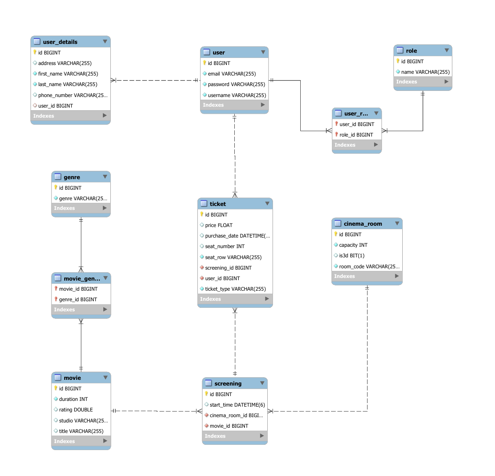

Maparea relatiilor in JPA:

* @OneToOne:
  * USER - USER_DETAILS
* @OneToMany/ @ManyToOne:
  * USER - TICKET
  * MOVIE - SCREENING
  * CINEMA_ROOM - SCREENING
  * SCREENING - TICKET
* @ManyToMany:
  * USER - ROLE
  * MOVIE - GENRE

## CascadeType si orphanRemoval

Pentru a mentine integritatea datelor si a proteja impotriva erorilor de stergere au fost configurate cateva reguli stricte de propagare:
* stergerea unui USER duce la stergerea detaliilor asociate din USER_DETAILS
* stergerea unui MOVIE duce la stergerea tuturor proiectiilor (SCREENING) si a biletelor (TICKET) emise pentru filmul respectiv
* analog pentru relatiile MOVIE — GENRE, respectiv CINEMA_ROOM — SCREENING

## 2 - Operatii CRUD

Arhitectura aplicatiei respecta modelul clasic multi-layer bazat pe **Repository Pattern Spring Data JPA**. 

Codul sursa este structurat in pachete:

* entity: definitia claselor
* repository: extindere a lui JpaRepository
* service: abstractizarea logicii de business
* controller: expunerea endpoint-urilor
* exception: tratarea centralizata a erorilor custom
* security: filtrele si configuratiile de autorizare

Stratul de Service a fost proiectat respectand principiul **Inversion of Control (IoC)**:
* pentru fiecare entitate a fost definita o interfata de servicii (ex. MovieService)
* implementarea efectiva a logicii a fost izolata intr-o clasa dedicata (ex. MovieServiceImpl), decupland astfel controllerele de detaliile tehnice de executie

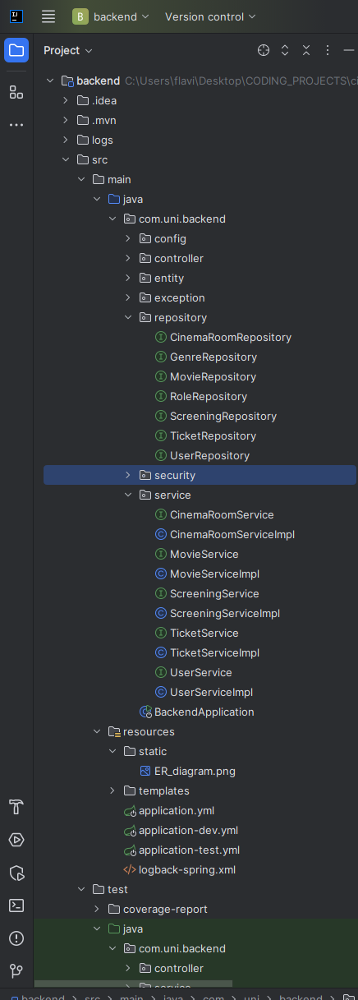

## 3 - Configurare Multi-Environment

Pentru a crea un **Multi-Environment** am construit doua baze de date:
* o baza pentru dezvoltare in MySQL cu configuratia definita in *application-dev.yml*
* o baza pentru testare **in-memory** H2 cu configuratia definita in *application-test.yml*

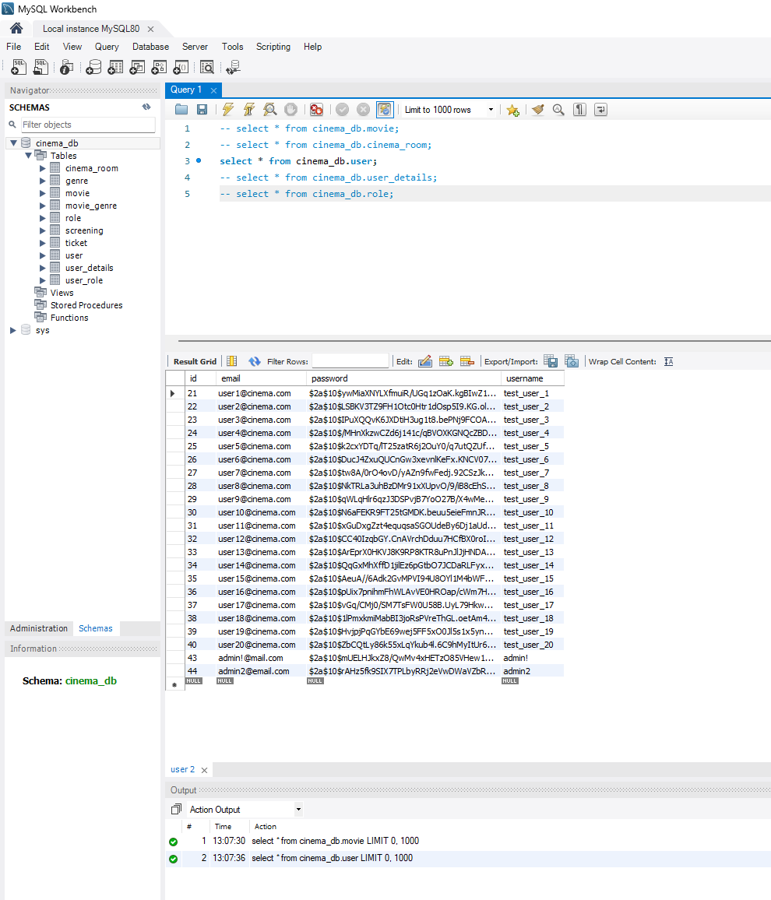

## 4 - Testing

### 4.1 - Teste unitare

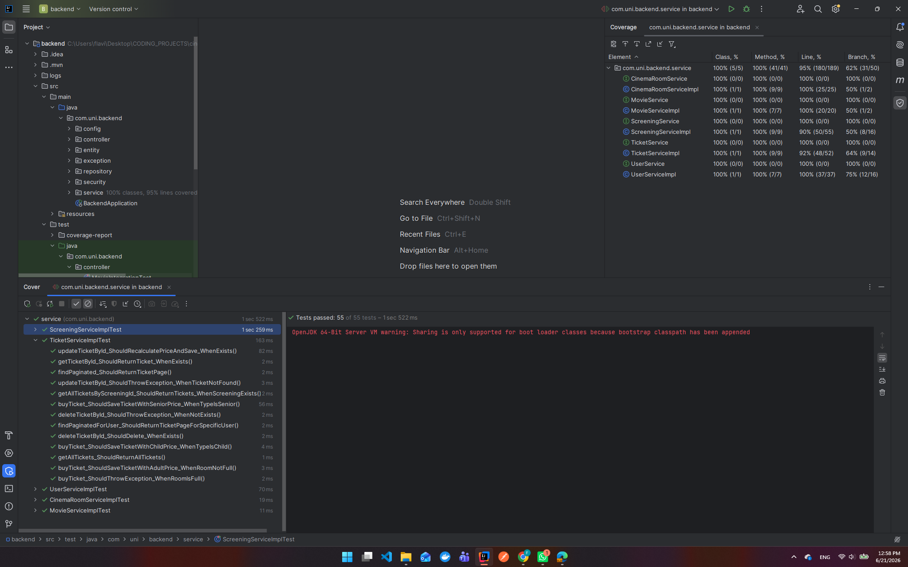

Pentru validarea Service Layer-uli am utilizat JUnit 5 in combinatie cu Mockito. 
Masurarea de Code Coverage a fost realizata prin intermediul pluginului JaCoCo. 
In rapoartele generate zonele marcate cu verde indica instructiuni trecute cu succes prin scenariile de test, in timp ce zonele rosii indica cod neacoperit.

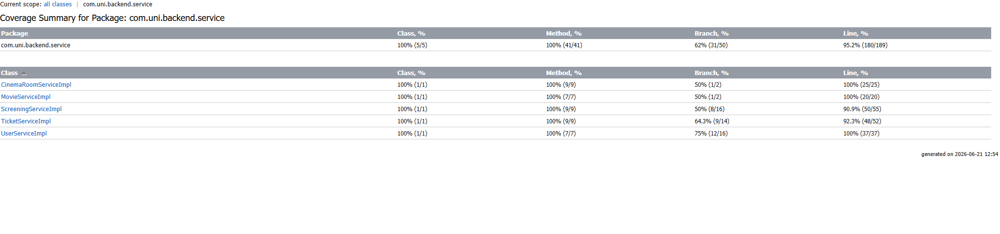

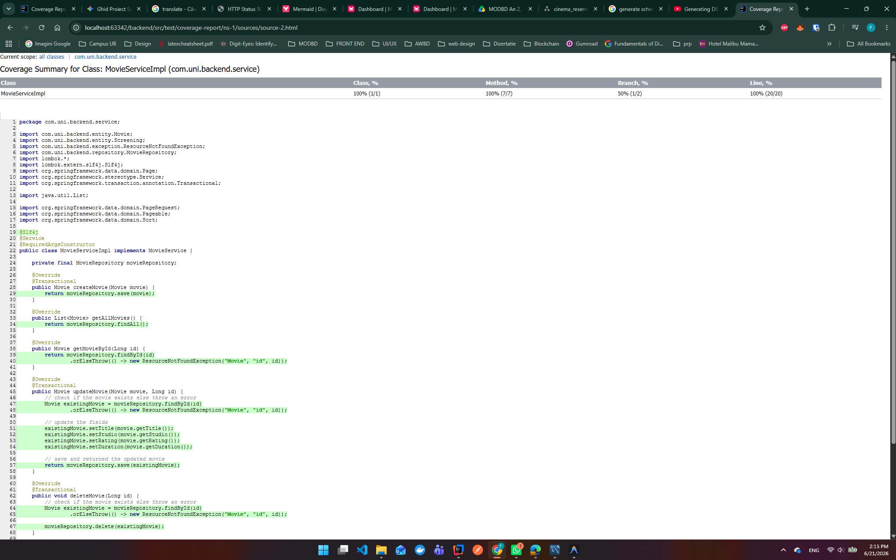

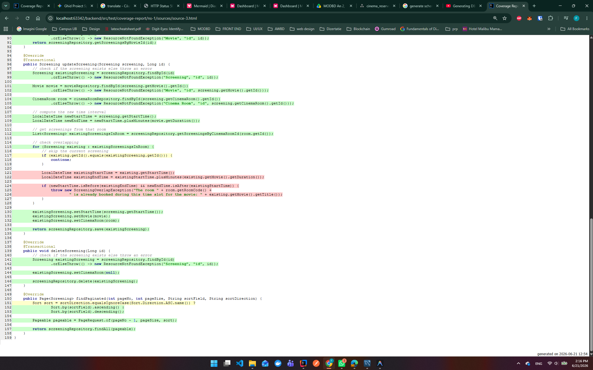

### 4.2 - Teste de integrare

Pentru a scrie testele de integrare am testat 3 scenarii end-to-end:
* AuthIntegrationTest: simulez cum un utilizator incearca sa isi creeze cont lasand un camp gol pentru a testa daca se intoarce la formular cu erori, urmat de o trimitere corecta a formularului
* ScreeningIntegrationTest: un ADMIN incearca sa adauge o proiectie care se suprapune cu alta, iar aplicatia trebuie sa refuze operatiunea si sa intoarca utilizatorul pe pagina cu acel overlapError custom
* TicketIntegrationTest: un USER cumpara un bilet; testez logica de autorizare prin faptul ca e logat ca USER, salvarea si ma asigur ca biletul cumparat va fi afisat in lista lui bilete

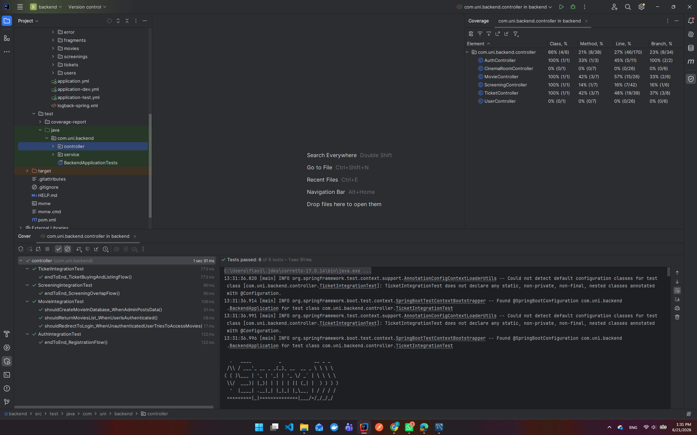

## 5 - Views si Validare

Interfata grafica este construita cu Thymeleaf, plus Bootstrap. 

Validarea datelor introduse de utilizatori se realizeaza:
* client-side prin atribute HTML de tip required, min, max
* server-side prin Jakarta Bean Validation: @NotBlank, @NotNull, @Min etc.

### 5.1 - Use View

Un utilizator normal cu rolul de USER poate:
* vedea lista cu filmele difuzate de cinematograf
* vedea lista salile de cinema
* vedea porgramul cinematografului (screenings)
* cumpara un bilet la un film si vedea biletele cumparate exclusiv de el

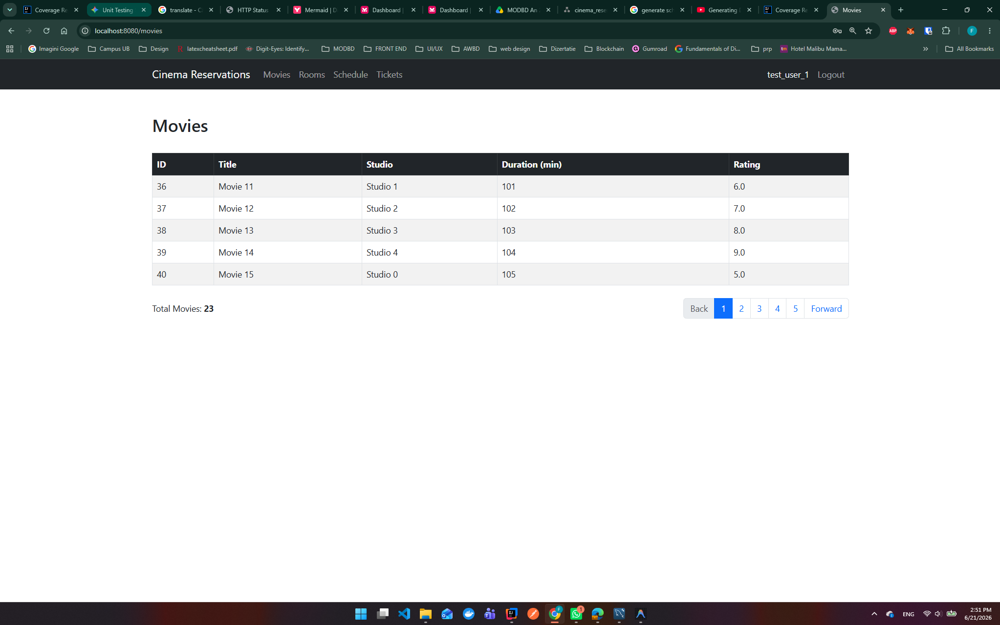

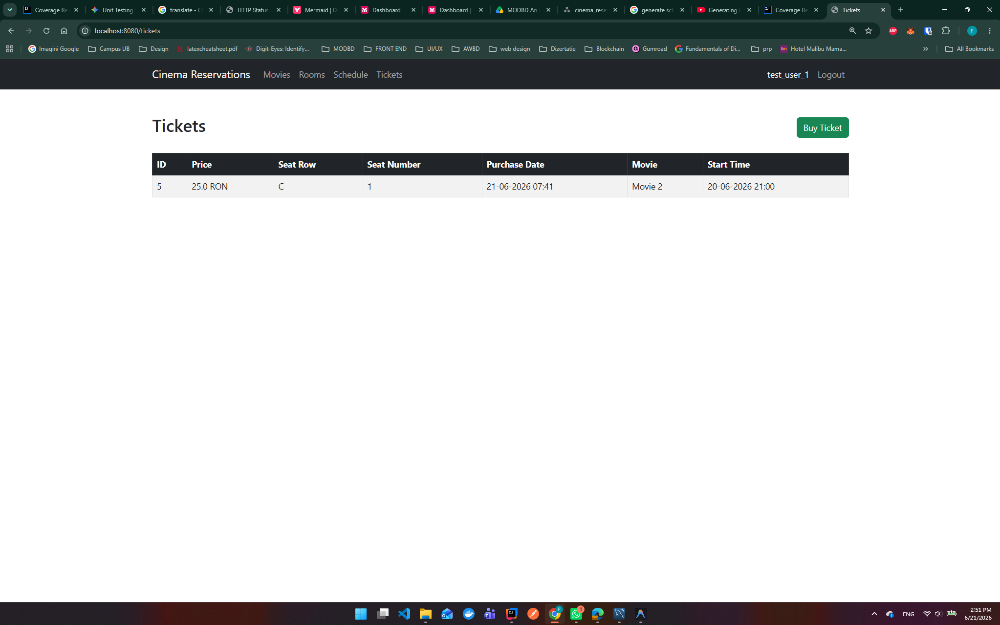

### 5.1 - Admin View

Un admin poate face aceleasi lucruri ca un USER normal, iar in plus poate:
* adauga, edita, sterge un film
* adauga, edita, sterge o camera de cinema
* programa, edita, sterge difuzarea unui film
* vedea biletele cumparate de toti utilizatorii
* edita, sterge un bilet
* edita, sterge utilizatori

Iata cateva capturi de ecran din pagina unui ADMIN:

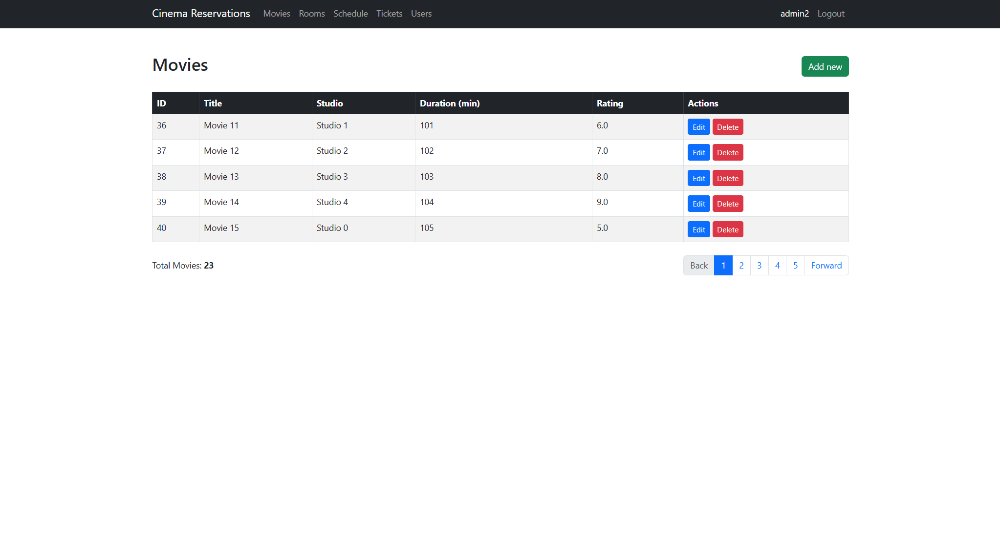

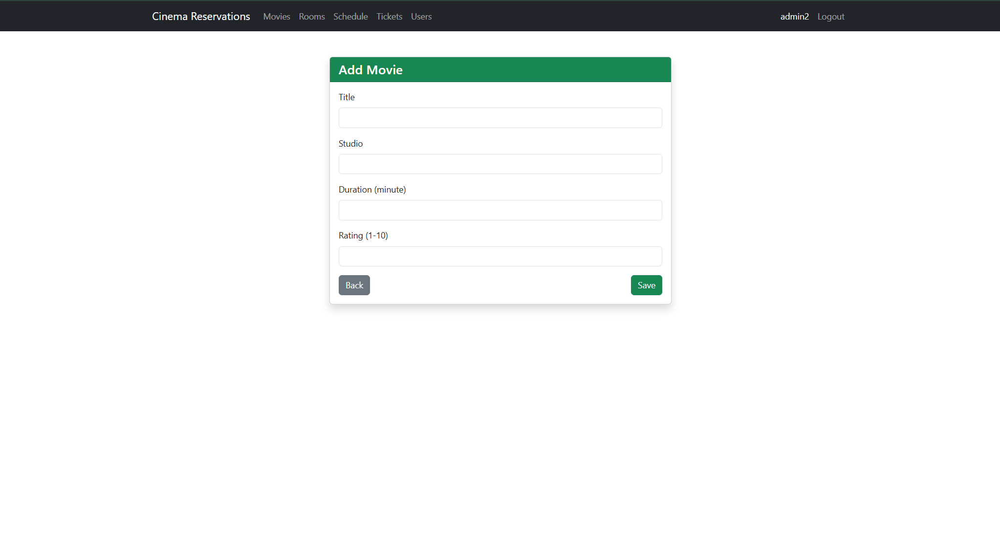

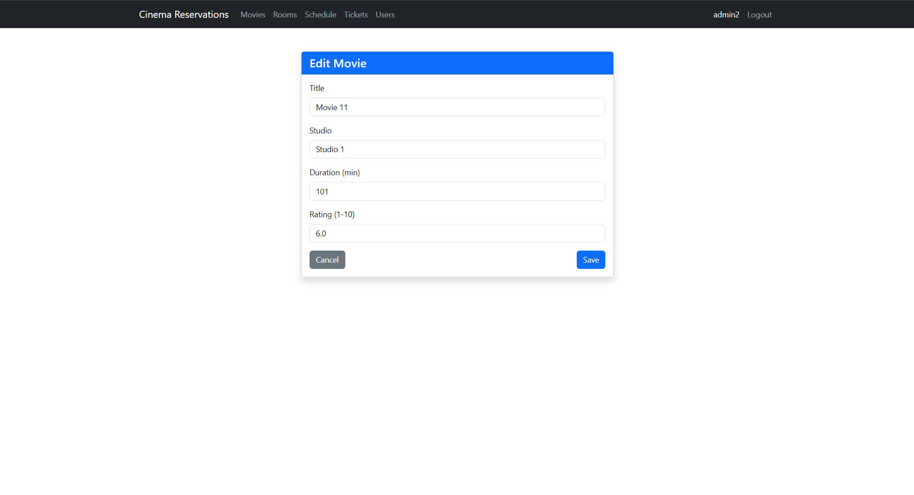

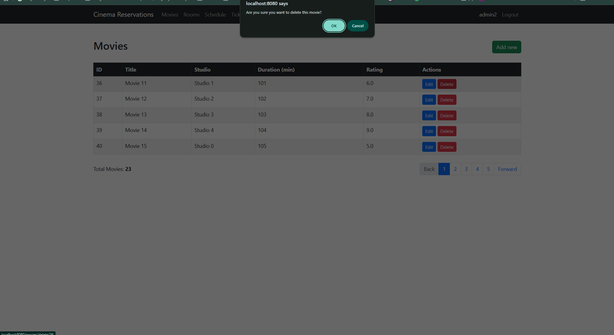

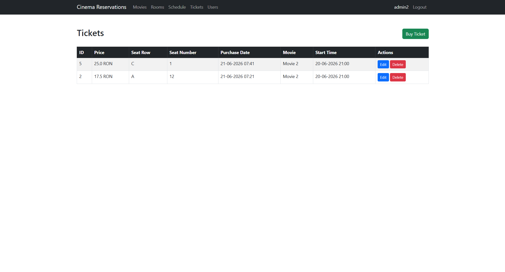

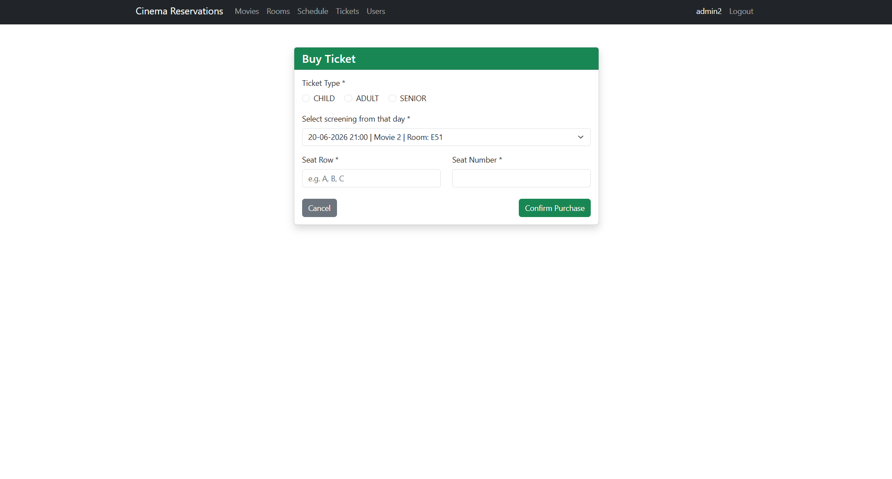

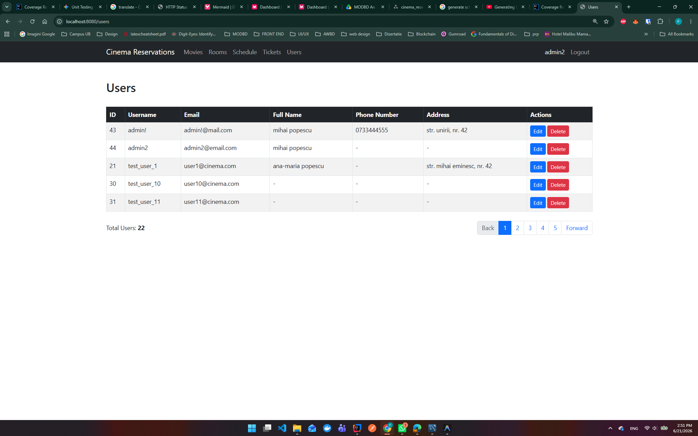

## 6 - Logging

Partea de logging a aplicatiei este asigurata prin SLF4J + Logback, configurat customizat prin fisierul logback-spring.xml. 
Sistemul diferentiaza evenimentele pe 3 niveluri de severitate (INFO, DEBUG, ERROR) si implementeaza o politica de arhivare periodica (TimeBasedRollingPolicy) de 30 de zile:
* application.log: captureaza intregul flux de operatiuni de business
* application-error.log: fisier dedicat izolarii si urmaririi exceptiilor de tip ERROR

Suplimentar a fost integrat un Aspect AOP (LoggingAspect) care intercepteaza automat executia tuturor metodelor din pachetul service, 
inregistrand in loguri atat intrarea in functii, cat si eventualele exceptii aruncate de acestea, fara a supraincarca codul inutil.

## 7 - Paginare si Sortare

Pentru a afisa liste cu entitati precum Movie, CinemaRoom, User se foloseste paginare la nivel de baza de date prin abstractizarea Page si Pageable din Spring Data.

Dimensiunea paginii este setata in mod implicit la 5 elemente.

Interfata ofera functionalitate de sortare dinamica, bidirectionala (asc / desc) direct la click pe capul de tabel.

## 8 - Spring Security

Securitatea apicatiei se utilizeaza **Spring Security**:

* autentificare JDBC & BCrypt:
  * autentificarea se realizeaza prin interogarea directa a bazei de date (folosind CustomUserDetailsService)
  * parolele sunt protejate si stocate exclusiv sub forma de hash-uri generate cu algoritmul BCrypt
  * procesul de logout este securizat, invalidand complet sesiunea utilizatorului si stergand cookie-ul JSESSIONID
* autorizare pe Roluri (USER si ADMIN): 
  * rutele care modifica baza de date (creare/editare/stergere) sunt restrictionate strict pentru utilizatorii cu rolul ADMIN
  * un USER simplu are acces doar la vizualizarea programului si cumpararea biletelor
  * pe frontend butoanele inaccesibile sunt ascunse dinamic (sec:authorize="hasRole('ADMIN'))
* functionalitati avansate: 
  * pentru o experienta mai buna s-a configurat functionalitatea Remember Me (max 24h)
  * toate formularele de tip POST sunt securizate nativ impotriva atacurilor CSRF (Cross-Site Request Forgery)

